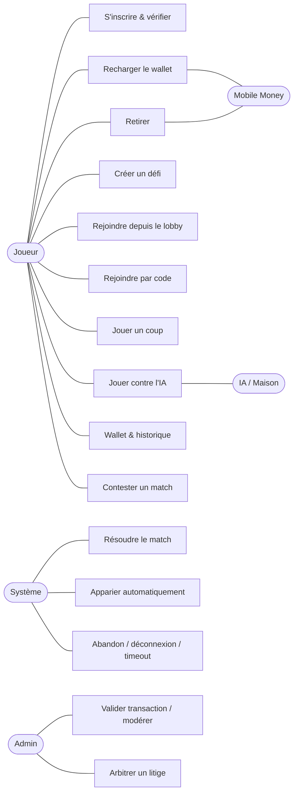
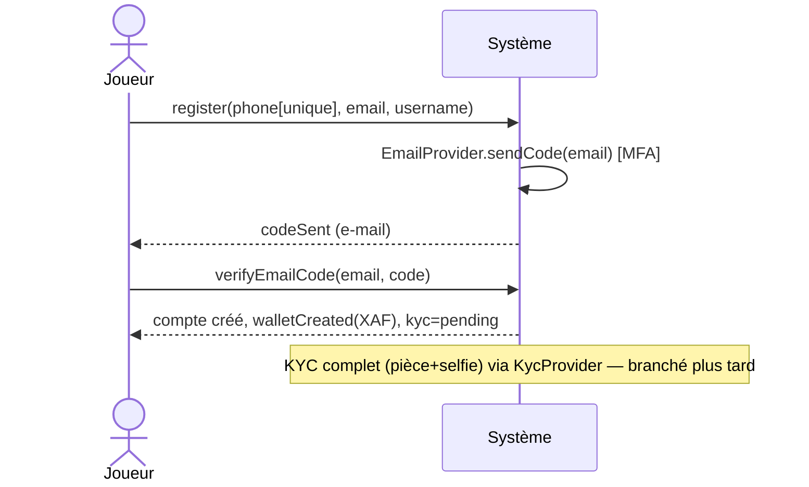
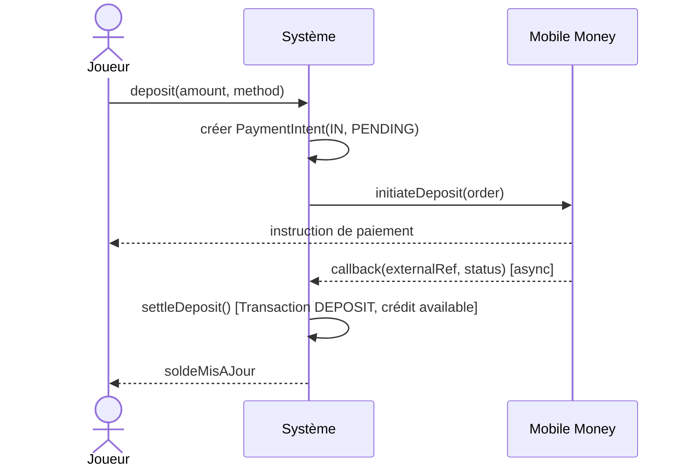
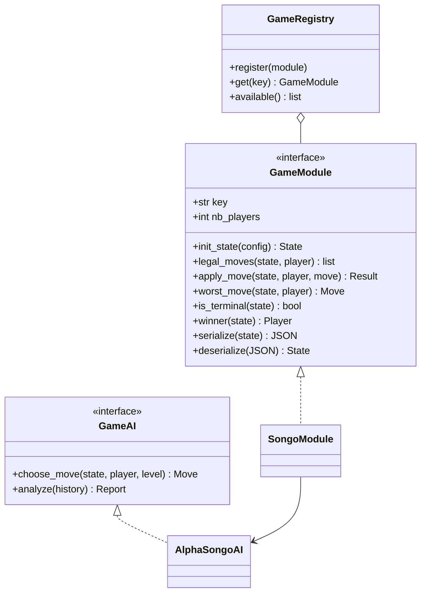
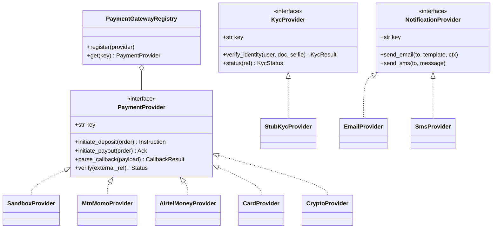
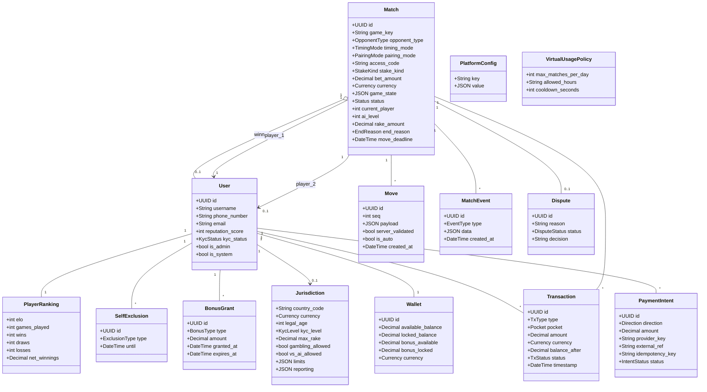
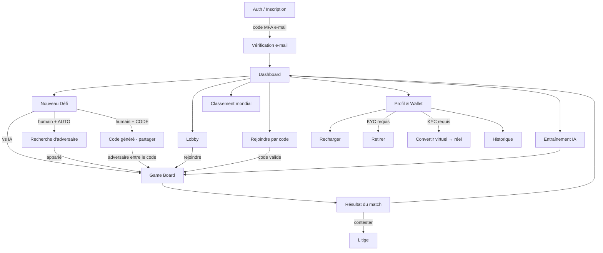
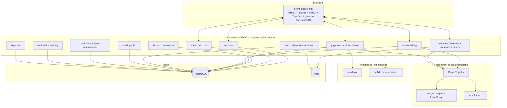

# Document de Conception — AfriBet
> **AfriBet** : plateforme P2P de paris sur jeux traditionnels africains. **Une seule
> plateforme Django** qui gère comptes, portefeuille électronique et lobby, et **intègre des
> jeux** via un framework enfichable. **Songo** est le premier module ; d'autres jeux suivront,
> dans des formats encore indéfinis — l'architecture doit pouvoir tous les accueillir.
>
> Le projet React/PWA antérieur n'est **pas** réutilisé : il a servi de **preuve de
> faisabilité** validant les règles et les maths du Songo, et la mécanique « timer + pire coup
> auto ». Il est ici une **référence**, pas une UI.
>
> Document de conception **complet** (aucun code — le code revient au MODE RÉALISATION).
> Statut : **v1.0 — proposé pour validation finale.** Inconnues restantes marquées
> `À CLARIFIER` (chiffres + points juridiques, non bloquants) ; écarts assumés vs la spec
> d'origine marqués `[AJUSTÉ]` ; valeurs par défaut proposées (configurables) marquées `[DÉFAUT]`.
---
## Comment lire ce document
Document **technique mais lisible**, destiné à être partagé entre équipes (produit, back-end,
front, conformité).
- **Structure** : six sections de référence — `Vision` · `Cas d'usage` · `Spécifications et DSS`
  · `Classes` · `Navigation` · `Conception détaillée`.
- **Diagrammes** : tous en **Mermaid** (rendus visuellement dans GitHub/GitLab, VS Code, Notion,
  l'app Claude…). Une **version HTML** est fournie à côté, où les diagrammes s'affichent dans un
  simple navigateur. Le seul schéma en ASCII est la maquette basse fidélité (volontaire).
- **Marqueurs** : `À CLARIFIER` = à décider (chiffres/juridique, non bloquant) · `[AJUSTÉ]` =
  écart assumé vs la spec d'origine · `[DÉFAUT]` = valeur proposée, **paramétrable**.
**Glossaire express**
- **P2P** : joueur contre joueur (*peer-to-peer*).
- **Escrow / séquestre** : mise bloquée le temps du match, réglée automatiquement à la fin.
- **Rake** : commission prélevée par AfriBet sur une partie en argent réel.
- **Maison** : la plateforme comme contrepartie financière des parties contre l'IA.
- **TRJ** : taux de retour au joueur (part des mises redistribuée ; l'inverse = avantage Maison).
- **KYC** (*Know Your Customer*) : vérification de l'identité et de l'âge du joueur.
- **AML** : lutte contre le blanchiment d'argent.
- **DSS** : diagramme de séquence système (échanges joueur ↔ système, système en boîte noire).
- **Poche réelle / virtuelle** : sous-soldes du portefeuille (argent réel retirable / bonus).
- **GDJ** : La Gabonaise des Jeux (régulateur des jeux au Gabon).
---
## Vision
### Positionnement
- **Pour qui :** des joueurs (Gabon d'abord, puis international), mobile-first, sur réseaux
  contraints, qui s'affrontent sur des jeux de stratégie ancestraux en misant des actifs réels,
  contre d'autres joueurs **ou contre l'IA** ; un administrateur pour la modération, la
  validation des transactions sensibles et l'arbitrage des litiges.
- **Pour quoi :** un écosystème de confiance et d'équité où le paiement des gains est garanti
  par un **séquestre (escrow) automatisé**, et où les soucis réseau ne se transforment jamais
  en perte injuste — point critique vu l'argent en jeu.
- **Ambition produit :** une **plateforme de jeux**, pas un seul jeu. Songo d'abord. Ajouter un
  jeu ne doit **jamais** toucher au cœur (comptes, wallet, matchmaking).
- **Modèle économique :** **rake** (commission) prélevé sur **toute partie jouée en argent réel**
  (P2P **et** vs-IA) ; **avantage Maison** additionnel sur les parties contre l'IA ; jamais de
  rake en mode virtuel ; publicités ciblées (post-MVP).
### Modèle financier directeur (façon PMU / Bet241)
Le joueur possède un **portefeuille électronique** interne, libellé en devise (XAF par défaut).
Il le **recharge** via mobile money / carte (dépôt), **joue** avec ce solde interne (les mises
sont verrouillées puis réglées en interne), et peut **retirer** son solde réel (reversement en
argent réel via retrait). Toute la dynamique de pari se passe **en monnaie interne** ; les ponts
avec l'argent réel sont les seuls points de contact avec les prestataires de paiement.
**Centralisation des fonds réels (point essentiel).** L'argent réel **n'est jamais détenu par
les joueurs sur la plateforme** : il transite et est **centralisé sur le(s) compte(s) mobile
money / bancaire(s) de la société AfriBet**. Concrètement :
- **Dépôt** : le joueur envoie de l'argent réel vers le **compte AfriBet** (via le prestataire) ;
  une fois la **réception réellement confirmée**, AfriBet **crédite** le portefeuille
  électronique du joueur du montant correspondant (monnaie interne).
- **Retrait** : AfriBet **débite** le portefeuille électronique et **envoie** l'argent réel
  depuis son compte centralisé vers le compte mobile money du joueur.
- Le portefeuille électronique est donc une **écriture de passif** d'AfriBet envers le joueur,
  adossée aux fonds réels centralisés.
- **Aucun crédit avant confirmation réelle** : un dépôt n'alimente la poche réelle qu'après preuve
  de réception (callback vérifié + `verify`), jamais sur la seule promesse du client.
- **Ségrégation** : fonds des joueurs séparés des revenus d'AfriBet (rake, avantage Maison) —
  exigence courante de protection des fonds des joueurs (cf. Conformité).
**Deux portefeuilles, une seule comptabilité claire.** Le portefeuille du joueur a **deux poches
strictement séparées** :
- **Réel** (`real`) : alimenté par les dépôts, adossé aux fonds réels centralisés d'AfriBet,
  **retirable** (convertible en argent réel via mobile money / carte).
- **Virtuel / bonus** (`bonus`) : crédité par un **bonus de bienvenue couplé au premier dépôt
  réel** — un **pourcentage paramétrable du 1er dépôt** (bonus de match ; ex. « 100 % de ton
  premier dépôt » selon la campagne pub). C'est de l'argent **virtuel, NON retirable
  directement** : on peut jouer avec, et il **n'a de valeur réelle que via la conversion à seuil**
  décrite ci-dessous (jamais de retrait direct du virtuel).
**Règles d'intégrité (essentielles, pour ne jamais mélanger réel et virtuel) :**
- Un match est financé par **une seule poche** : `stake_kind = REAL | BONUS`. On ne mise jamais
  du réel contre du virtuel dans le même pot. Un défi en bonus oppose **virtuel contre virtuel**
  (ou virtuel contre la Maison en mode virtuel).
- Les **gains restent dans la poche virtuelle** au fil du jeu (ils ne créent aucune dette réelle
  tant qu'ils ne sont pas convertis).
- **Conversion virtuel → réel par tranches entières** : on convertit **uniquement par multiples
  entiers** du seuil. On regarde **combien de fois 2 000 000** tient dans le solde virtuel ;
  chaque tranche **2 000 000 → 10 000 réels** (XAF, ratio **200:1** ≈ 0,5 %). **Pas de virgule** :
  le **reste** (< 2 000 000) **demeure dans le portefeuille virtuel**.
  *Ex. : 7 000 000 → 3 tranches (6 000 000) = **30 000 réels**, et **1 000 000 reste en virtuel**.*
  Formellement `n = ⌊virtuel / 2 000 000⌋` → `n × 10 000` réels ; `reste = virtuel − n × 2 000 000`
  reste virtuel. Seuil et taux **paramétrables**. C'est le **seul** pont virtuel → réel.
- **Alimentation du virtuel : UNE seule fois (au 1er dépôt).** La poche virtuelle n'est créditée
  **qu'une fois**, par le **bonus de match du premier dépôt**. Elle **ne peut jamais** être
  rechargée — ni carte, ni mobile money, ni crypto, **ni depuis le compte réel**. Elle ne
  **grossit qu'en gagnant** des matchs virtuels. **Une fois épuisée** (retombée à 0 après avoir
  été utilisée), la poche virtuelle est **définitivement close** : elle **reste à 0 à vie** (pas
  de second bonus). *(Le compte réel, lui, s'alimente par dépôts mobile money / carte / crypto.)*
- **Réconciliation** : la poche **réelle** correspond aux fonds réels centralisés ; la poche
  **bonus** est virtuelle **sans contrepartie réelle** — **sauf** lors d'une conversion, qui crée
  une **dette réelle** (10 000 par tranche) à provisionner.
- **Exposition bornée par construction** : le bonus étant **couplé au 1er dépôt** (% du dépôt),
  octroyé **une seule fois**, et le P2P virtuel étant à **somme nulle**, l'enveloppe convertible
  totale est **plafonnée** (≈ Σ bonus de match ÷ 200). **Condition** : en virtuel vs IA, la Maison
  ne doit **pas créer de virtuel net** (IA ≥ équilibre). **Backstop** : un **plafond global de
  conversion** paramétrable borne l'exposition réelle quoi qu'il arrive. **Bénéfice** : coupler au
  dépôt **pousse au dépôt réel** tout en gardant l'exposition maîtrisée.
- **Usage du virtuel bridé (le réel doit rester principal).** Pour éviter qu'on ne joue **que** en
  virtuel — ce qui ferait d'AfriBet un distributeur net d'argent — l'usage du mode virtuel est
  **contraint et paramétrable** : nombre de **matchs virtuels par jour**, **fenêtre horaire**,
  **cooldown** entre parties, éligibilité limitée dans le temps. Le **réel n'est pas bridé**.
  Le virtuel reste un **petit cadeau d'accueil**, pas un mode permanent.
- **Anti-abus** : un seul bonus par identité/appareil vérifié ; **conversion sous KYC** +
  **anti-collusion** (seuil élevé + ratio 200:1 → farming non rentable).
### Exigences fonctionnelles (EF)
- **EF1** — S'inscrire avec **numéro de téléphone unique** (obligatoire) + e-mail, **vérifié par
  code MFA e-mail** (MVP) ; vérification d'identité (**KYC**) différée via adaptateur.
- **EF2** — S'authentifier (JWT).
- **EF3** — Recharger le portefeuille (dépôt) via **mobile money** ou **carte bancaire**
  (principalement **Visa prépayée**) ; *(futur : monnaies numériques / Bitcoin).*
- **EF4** — Retirer le solde (retrait) vers **mobile money** ou carte ; *(futur : crypto).*
- **EF5** — Consulter ses **soldes** (poche réelle **et** bonus : disponible / verrouillé) et
  l'historique des transactions.
- **EF5b** — Recevoir un **bonus de bienvenue couplé au 1er dépôt** (pourcentage **paramétrable**
  du premier dépôt réel ; crédits **virtuels non retirables**) et **jouer en mode virtuel** avec.
- **EF5c** — **Convertir** le solde virtuel en réel **au seuil** (2 000 000 virtuels → 10 000
  réels `[DÉFAUT]`, ratio 200:1, **par tranches entières**, reste laissé en virtuel, sous KYC).
- **EF5d** — **Brider l'usage du mode virtuel** (limites matchs/jour, fenêtre horaire, cooldown)
  pour que le **réel reste le portefeuille principal** ; tout paramétrable depuis le hub admin.
- **EF6** — Verrouiller les fonds (escrow) à l'engagement d'un pari.
- **EF7** — Créer un défi en choisissant : le **jeu**, l'**adversaire** (humain ou IA), le
  **mode** (temps réel ou différé), l'**appariement** (automatique par le serveur **ou** par
  **code d'accès** privé partageable), et la **mise**.
- **EF7b** — Être apparié **automatiquement** : le serveur met le créateur en attente et le
  relie à un joueur éligible acceptant la même mise (recherche d'adversaire).
- **EF7c** — Rejoindre **par code d'accès** : le créateur génère un code partageable
  (WhatsApp / SMS / copier-coller) ; un adversaire précis saisit ce code pour se connecter au
  plateau privé.
- **EF8** — Lobby : lister, filtrer, rejoindre les défis **publics** (appariement automatique).
- **EF9** — Jouer un match en temps réel ou en différé, **validé par le serveur**.
- **EF10** — Résoudre le match : déterminer le gagnant, régler l'escrow, prélever le rake.
- **EF11** — Gérer abandon, déconnexion, timeout de coup et faute réseau de façon **équitable**.
- **EF12** — Jouer / s'entraîner contre l'**IA** (avec ou sans enjeu).
- **EF13** — Admin : back-office d'exploitation — modérer, valider les transactions sensibles,
  **arbitrer les litiges**, **paramétrer** la plateforme (le moins d'actions humaines possible,
  le reste automatisé).
- **EF14** *(extensibilité jeux)* — Enregistrer un **nouveau jeu** via le framework, sans
  modifier comptes / wallet / matchmaking.
- **EF15** *(extensibilité paiement)* — Brancher un **nouveau prestataire** (mobile money, carte,
  crypto) via une interface commune, sans modifier la logique du wallet.
- **EF16** — **Jeu responsable** : limites de dépôt/mise/temps paramétrables, auto-exclusion,
  messages de prévention (exigence de conformité).
- **EF17** — **Configurer une juridiction** (pays) : âge légal, devise, moyens autorisés, niveau
  KYC, plafonds, mentions — depuis le hub admin, sans recoder.
- **EF18** — **Classement mondial Elo** + statistiques (parties, V/N/D, gains nets).
- **EF19** *(post-MVP)* — Réputation, publicités, tournois.
### Exigences non fonctionnelles (ENF) — exigences de code en AR
- **ENF1 — Intégrité financière (CRITIQUE).** Moteur de jeu **serveur-autoritaire** ; escrow et
  règlements **atomiques** (ACID) ; registre de transactions immuable ; pas de double dépense.
- **ENF2 — Équité & protection juridique (CRITIQUE).** Aucune perte sèche due au réseau ;
  fenêtre de reconnexion ; coups auto plutôt que défaite immédiate ; annulation/remboursement en
  cas de faute serveur ; **journal d'audit horodaté** de tout événement de match ; voie de
  litige.
- **ENF3 — Modularité & extensibilité.** Séparation stricte **plateforme / jeu** et
  **wallet / prestataire de paiement** ; tout est derrière des interfaces ; aucune fuite de
  spécifique.
- **ENF4 — Robustesse du moteur & de l'IA.** Moteur et IA isolés (Python pur, sans framework),
  déterministes, **entièrement testés**.
- **ENF5 — Performance / faible bande passante.** Payloads légers, reconnexion résiliente,
  mobile-first.
- **ENF6 — Ergonomie & accessibilité.** Usage à une main, retours haptiques, contraste,
  lisibilité petits écrans, i18n.
- **ENF7 — Cohérence temps réel.** Source de vérité unique = serveur ; reprise d'état après
  coupure.
- **ENF8 — Sécurité.** JWT, anti-fraude, anti-collusion, idempotence des paiements,
  protection des callbacks.
- **ENF9 — Conformité jeux d'argent (paramétrable).** Traitée comme une **couche de configuration
  par juridiction** (`Jurisdiction`) : âge légal, KYC/AML, jeu responsable, plafonds, TRJ,
  reporting — activables par pays sans recoder (détail §14). Régime particulier pour le **vs-IA**
  (proche casino). `À CLARIFIER : agrément GDJ, fiscalité, statut skill vs hasard.`
### Contraintes
- **Plateforme Django unique** (backend + temps réel + admin).
- Premier jeu = **Songo** (règles validées par le PoC).
- Devise par défaut **XAF** ; **mobile-first** ; prestataires de paiement **non encore choisis**
  (brancher plus tard).
### Principe d'architecture directeur — trois frontières infranchissables
1. **Plateforme ↔ Jeu** : la plateforme ne connaît aucune règle de jeu. Un match a un
   `game_key`, un état **opaque**, une mise, un gagnant. Les jeux sont des plugins (`GameModule`).
2. **Wallet ↔ Prestataire de paiement** : le wallet raisonne en monnaie interne ; les
   prestataires mobile money sont des plugins (`PaymentProvider`).
3. **Logique métier ↔ Framework web** : moteur, IA, services métier sont du Python pur ; Django
   (vues, consumers, modèles) n'est qu'une **couche d'adaptation**.
### Esquisse des écrans clés (basse fidélité)
```
┌────────────┐  ┌────────────┐  ┌──────────────┐  ┌────────────┐
│ DASHBOARD  │  │   LOBBY    │  │  GAME BOARD  │  │  WALLET    │
│ Solde XXX  │  │ Songo 500  │  │  ┌────────┐  │  │ Dispo XXX  │
│ [Nouv.Défi]│  │ ⏱ temps réel│  │  │ Plateau│  │  │ Bloqué YYY │
│ [Vs IA]    │  │ Songo 1k   │  │  │  (jeu) │  │  │ [Recharger]│
│ Mes défis ⏳│  │ ✉ différé   │  │  └────────┘  │  │ [Retirer]  │
│ Historique │  │ [Filtre]   │  │ ⏱30s Adv|Vous │  │ Historique │
└────────────┘  └────────────┘  └──────────────┘  └────────────┘
```
---
## Cas d'usage
### Acteurs
- **Joueur** *(principal)* — s'inscrit, recharge, défie (humain ou IA), joue, retire, conteste.
- **Administrateur** — modère, valide les transactions sensibles, arbitre les litiges.
- **Système** *(secondaire)* — résout les matchs, gère escrow, timers, déconnexions.
- **IA / Maison** *(secondaire interne)* — adversaire non humain et contrepartie financière.
- **Prestataire de paiement / Mobile Money** *(secondaire externe)* — dépôts / retraits (MVP :
  **sandbox** uniquement).
- **Prestataire d'e-mail / SMS** *(secondaire externe)* — code MFA (e-mail actif au MVP ; SMS
  plus tard), via `NotificationProvider`.
- **Prestataire KYC** *(secondaire externe)* — vérification d'identité **différée** ; `StubKycProvider`
  au MVP, prestataire tiers greffé ensuite.
### Diagramme des cas d'usage

### Liste, priorisation & itérations
| # | Cas d'usage | Acteur | Priorité | Itération |
|---|-------------|--------|----------|-----------|
| CU1 | S'inscrire & vérifier (e-mail) ; KYC différé | Joueur | P0 | 1 |
| CU2 | Recharger le wallet (dépôt) | Joueur | P0 | 1 |
| CU3 | Créer un défi (jeu/adversaire/mode/appariement/mise) | Joueur A | P0 | 1 |
| CU3b | Apparier automatiquement (recherche d'adversaire) | Système | P0 | 1 |
| CU4 | Rejoindre depuis le lobby (public/auto) | Joueur B | P0 | 1 |
| CU4b | Rejoindre par code d'accès (privé) | Joueur B | P0 | 1 |
| CU5 | Jouer un coup (temps réel / différé) | Joueur | P0 | 1 |
| CU6 | Résoudre le match (escrow + rake) | Système | P0 | 1 |
| CU8 | Abandon / déconnexion / timeout | Système | P0 | 1 |
| CU11 | Jouer contre l'IA (avec/sans enjeu) | Joueur | P0 | 1 |
| CU16 | Bonus de bienvenue & jeu en mode virtuel | Joueur | P1 | 1-2 |
| CU17 | Convertir le solde virtuel en réel (au seuil) | Joueur | P1 | 1-2 |
| CU7 | Retirer des fonds | Joueur | P1 | 2 |
| CU9 | Wallet & historique | Joueur | P1 | 2 |
| CU10 | Admin : valider / modérer | Admin | P1 | 2 |
| CU12 | Arbitrer un litige | Admin | P1 | 2 |
| CU13 | Contester un match | Joueur | P1 | 2 |
| CU14 | Enregistrer un nouveau jeu | (dév) | P2 | 3 |
| CU15 | Consulter le classement mondial (Elo) | Joueur | P2 | 3 |
| — | Réputation, pub, tournois | — | P2 | 3 |
> **CU8 (équité) passe en P0 / itération 1** : impossible de livrer du pari réel sans gérer
> proprement les déconnexions. C'est une exigence de confiance, pas une option.
**Itération 1 = boucle de pari sûre de bout en bout** : s'inscrire → recharger →
créer/rejoindre (vs humain ou IA) → jouer (avec gestion réseau) → être réglé.
---
## Spécifications et DSS
> Le « Système » est une boîte noire ; les messages qu'il reçoit = **opérations système**
> (= contrat d'API). Le vocabulaire reste **générique** : jamais « graine » ni « trou » au
> niveau plateforme.
### CU1 — S'inscrire & vérifier (MFA e-mail) + KYC
- **Préconditions :** **numéro de téléphone unique** (non déjà enrôlé) + e-mail.
- **Postconditions :** `User` créé (téléphone unique enregistré), e-mail **vérifié par code MFA**,
  KYC à l'état `pending` (vérification d'identité différée), wallet (XAF) créé à zéro.
- **Nominal (MVP) :** saisir **téléphone (obligatoire, unique)** + e-mail + pseudo → recevoir un
  **code MFA par e-mail** → valider → accès. La **vérification d'identité (KYC)** complète (pièce
  + selfie) est **branchée plus tard** via un prestataire (adaptateur), et conditionne les
  retraits / la conversion.
- **Alternatifs :** code invalide/expiré → renvoi ; téléphone déjà utilisé → refus (unicité) ;
  KYC non validé → **accès limité** (jouer en virtuel oui ; retrait/conversion non).
> **Adaptateurs (comme pour les paiements)** : `EmailProvider` (code MFA — backend console en dev,
> SMTP/API plus tard), `SmsProvider` (présent mais **inutilisé au MVP** ; OTP SMS activable quand
> un prestataire existe), `KycProvider` (vérification d'identité — **stub** au MVP, prestataire
> tiers greffé ensuite). **Décidé : MVP = vérification par e-mail, téléphone unique obligatoire.**

### CU2 — Recharger le wallet (dépôt)
- **Préconditions :** joueur authentifié et **compte vérifié (e-mail)**. *(Le niveau de KYC exigé
  pour déposer est **paramétrable par juridiction** ; au MVP, paiement en **sandbox** et KYC
  d'identité différé. Le KYC complet conditionne le **retrait** et la **conversion**.)*
- **Postconditions :** à confirmation prestataire, `available_balance` crédité ;
  `Transaction(DEPOSIT)` réglée.
- **Nominal :** demander un dépôt (montant, moyen) → ordre créé `PENDING` → instruction de
  paiement (USSD/redirection) → callback prestataire → crédit.
- **Alternatifs :** paiement échoué/expiré → ordre `FAILED`, pas de crédit ; callback dupliqué →
  ignoré (idempotence).

### CU3 — Créer un défi
- **Préconditions :** authentifié, KYC validé, solde disponible ≥ mise, `game_key` enregistré ;
  si adversaire = IA, niveau choisi.
- **Postconditions :** mise du créateur **verrouillée** ; selon l'appariement :
  - **vs IA** → `Match` directement `ACTIVE` ;
  - **vs humain / AUTO** → `Match` `PENDING`, **publié au Lobby** et mis en **file
    d'appariement** (le serveur cherche un adversaire — CU3b) ;
  - **vs humain / CODE** → `Match` `PENDING` **privé** (non listé), un **code d'accès** est
    généré et renvoyé au créateur pour partage.
- **Nominal :** choisir jeu + adversaire + mode + **appariement (AUTO ou CODE)** + **poche
  (`stake_kind` = réel ou virtuel)** + mise → vérifier KYC/solde de la **poche choisie** →
  verrouiller → créer (+ générer le code si CODE).
- **Alternatifs :** solde insuffisant → refus ; mise hors bornes → refus ; annulation avant
  adversaire → fonds libérés, `CANCELLED` ; code expiré → régénérable.
```mermaid
sequenceDiagram
    actor JA as Joueur A
    participant S as Système
    JA->>S: createChallenge(gameKey, opponentType, timingMode, pairingMode, stakeKind, betAmount, aiLevel?)
    S->>S: vérifier KYC + solde + bornes de mise
    S->>S: lockFunds(A, betAmount)  [Transaction BET_LOCK]
    alt adversaire = IA
        S->>S: lockHouseStake(); initState(); status=ACTIVE
    else humain + AUTO
        S->>S: status=PENDING; publier au Lobby + file d'appariement
    else humain + CODE
        S->>S: status=PENDING privé; générer access_code
    end
    S-->>JA: matchId, status, access_code?
```
### CU4 — Rejoindre depuis le lobby (public / auto)
- **Préconditions :** `Match` `PENDING` public, joueur ≠ créateur, solde disponible ≥ mise.
- **Postconditions :** mise du second verrouillée ; état initialisé via
  `GameModule.init_state()` ; `ACTIVE` ; retiré du lobby ; bascule Game Board pour les deux.
- **Alternatifs :** course (déjà rejoint) → refus, retour au lobby ; solde insuffisant → refus.
```mermaid
sequenceDiagram
    actor JB as Joueur B
    participant S as Système
    JB->>S: joinFromLobby(matchId)
    S->>S: vérifier disponibilité + solde
    S->>S: lockFunds(B, betAmount)  [Transaction BET_LOCK]
    S->>S: GameModule.init_state(); status=ACTIVE; retirer du lobby; armer timer
    S-->>JB: matchId, ACTIVE, gameState
    S-->>JA: matchStarted (push)
```
### CU3b — Apparier automatiquement (recherche d'adversaire)
- **Préconditions :** au moins deux `Match` `PENDING`/AUTO compatibles (même jeu, mode, mise,
  bornes) en file, **ou** un joueur acceptant un défi listé.
- **Postconditions :** les deux joueurs sont reliés sur **un seul** match `ACTIVE` (l'autre
  défi en attente est, le cas échéant, fusionné/annulé proprement et les fonds réconciliés).
- **Nominal :** le créateur attend (« recherche d'adversaire… ») ; un worker d'appariement
  relie deux joueurs éligibles dès qu'ils existent → push aux deux.
- **Alternatifs :** délai d'attente dépassé → notification + possibilité d'annuler (fonds
  libérés) ou de basculer en code.
```mermaid
sequenceDiagram
    actor JA as Joueur A en attente
    participant S as Système
    actor JB as Joueur B
    JA->>S: createChallenge(... AUTO ...)  [PENDING, en file]
    Note over S: worker d'appariement scrute la file
    JB->>S: rejoint (lobby) ou entre en file compatible
    S->>S: pair(JA, JB); lockFunds(B); init_state(); status=ACTIVE
    S-->>JA: matchStarted (push)
    S-->>JB: matchStarted (push)
```
### CU4b — Rejoindre par code d'accès (privé)
- **Préconditions :** code valide et non expiré, match `PENDING` privé, joueur ≠ créateur,
  solde disponible ≥ mise.
- **Postconditions :** identiques à CU4 (mise verrouillée, `ACTIVE`, bascule Game Board).
- **Alternatifs :** code inconnu/expiré → erreur ; déjà rejoint → refus ; solde insuffisant →
  refus.
```mermaid
sequenceDiagram
    actor JB as Joueur B
    participant S as Système
    Note over JB: a reçu le code via WhatsApp/SMS
    JB->>S: joinByCode(access_code)
    S->>S: résoudre code -> match privé; vérifier validité + solde
    S->>S: lockFunds(B, betAmount); init_state(); status=ACTIVE; invalider le code
    S-->>JB: matchId, ACTIVE, gameState
    S-->>JA: matchStarted (push)
```
### CU5 — Jouer un coup
- **Préconditions :** `Match` `ACTIVE`, tour du joueur, coup légal selon le module.
- **Postconditions :** état **autoritaire** mis à jour ; `Move` journalisé ; tour passé ; timer
  réarmé (temps réel) ; push aux deux.
- **Alternatifs :** coup illégal → rejet, état inchangé ; expiration du timer → **pire coup auto**
  (temps réel) ; coup terminal → CU6.
```mermaid
sequenceDiagram
    actor J as Joueur
    participant S as Système
    J->>S: playMove(matchId, move)
    S->>S: GameModule.legal_moves() + valider
    S->>S: GameModule.apply_move() -> state, events
    S->>S: journaliser Move; GameModule.is_terminal()
    alt terminal
        S->>S: resolveMatch(matchId)  [CU6]
    else continuer
        S->>S: réarmer timer 30s
    end
    S-->>J: newState, events, nextPlayer
    S-->>J: (push adversaire)
```
### CU6 — Résoudre le match
- **Préconditions :** condition de fin (règles du jeu, forfait, timeout, déconnexion prolongée).
- **Postconditions :** gagnant déterminé **par le serveur** ; escrow réglé **atomiquement**
  (rake prélevé, gains versés / remboursement si nul ou void) ; `COMPLETED` (ou `CANCELLED`/void) ;
  transactions écrites ; `MatchEvent(RESOLVE)` journalisé.
```mermaid
sequenceDiagram
    participant S as Système
    S->>S: déterminer issue (winner | draw | void | forfeit)
    alt victoire
        S->>S: settleEscrow(winner)  [BET_WIN + COMMISSION rake] (atomique)
    else nul
        S->>S: refundEscrow(both)  [REFUND]
    else void / faute serveur
        S->>S: refundEscrow(both)  [REFUND]
    end
    S->>S: status final; journaliser
    S-->>S: matchResult (push aux 2)
```
### CU8 — Abandon / déconnexion / timeout (équité)
- **Préconditions :** `Match` `ACTIVE`.
- **Postconditions :** selon le cas, coup auto, attente de reconnexion, forfait, ou void avec
  remboursement ; tout est **journalisé** pour audit.
- **Scénarios :**
  - **Abandon volontaire** (bouton forfait) → forfait immédiat, adversaire gagne, escrow réglé.
  - **Timeout de coup** (30 s `[DÉFAUT]`, temps réel) → le serveur joue le **pire coup légal**
    (`is_auto=true`), jamais une perte sèche.
  - **Déconnexion** → fenêtre de reconnexion (45 s `[DÉFAUT]`) ; le timer de coup continue.
    Reconnexion → resynchro d'état.
  - **Panne côté serveur / nous** → match **void**, **remboursement** des deux, aucun gagnant.
  - **Coupure côté joueur non récupérée** → selon `DisconnectPolicy` : `AUTO_RESOLVE` (la partie
    se poursuit en coups auto et se résout) **ou** `VOID_REFUND` (void + remboursement), avec
    **anti-abus** (compteur, plafonds, réputation).
- **Contestation** → ouvre CU13 → arbitrage admin (CU12).
```mermaid
sequenceDiagram
    participant S as Système
    Note over S: détection via heartbeat WebSocket
    alt abandon volontaire
        S->>S: forfait -> resolveMatch(adversaire)
    else timeout coup (temps réel)
        S->>S: GameModule.worst_move(); apply; Move(is_auto)
    else déconnexion
        S->>S: ouvrir fenêtre grâce 45s; timer continue
        alt reconnexion
            S-->>S: getState() resynchro
        else panne serveur / nous
            S->>S: void + refundEscrow(both)
        else coupure joueur non récupérée
            S->>S: DisconnectPolicy: AUTO_RESOLVE (coups auto) ou VOID_REFUND
            S->>S: anti-abus (compteur, plafond, réputation)
        end
    end
    S->>S: journaliser MatchEvent
```
### CU7 — Retirer des fonds
- **Préconditions :** authentifié, KYC validé, `available_balance` ≥ montant, contrôles AML.
- **Postconditions :** `available_balance` débité (réservé), ordre de payout `PENDING` →
  confirmation prestataire → `Transaction(WITHDRAWAL)` réglée.
- **Alternatifs :** solde insuffisant → refus ; payout échoué → re-crédit du solde ; montant
  sensible → validation admin (CU10).
```mermaid
sequenceDiagram
    actor J as Joueur
    participant S as Système
    participant MM as Mobile Money
    J->>S: withdraw(amount, destination)
    S->>S: vérifier solde + AML; réserver le montant
    S->>S: créer PaymentIntent(OUT, PENDING)
    S->>MM: initiatePayout(order)
    MM-->>S: callback(status) [async]
    alt succès
        S->>S: Transaction WITHDRAWAL (débit définitif)
    else échec
        S->>S: re-créditer available
    end
    S-->>J: statut du retrait
```
### CU11 — Jouer contre l'IA
- **Préconditions :** authentifié ; si avec enjeu : KYC + solde ≥ mise + mise ≤ plafond Maison.
- **Postconditions :** `Match(opponent=AI)` ; la **Maison** est contrepartie ; à chaque tour IA,
  `AlphaSongoAI.choose_move()` joue ; résolution comme CU6 (gains payés par/à la Maison).
- **Alternatifs :** mode entraînement (sans enjeu) → pas d'escrow, pas de rake.
```mermaid
sequenceDiagram
    actor J as Joueur
    participant S as Système
    participant IA as AlphaSongoAI
    J->>S: playMove(matchId, move)
    S->>S: valider + apply; is_terminal?
    alt non terminal et tour IA
        S->>IA: choose_move(state, level)
        IA-->>S: move
        S->>S: valider + apply
    end
    S-->>J: nouvel état (coups joueur + IA)
```
### CU16 — Bonus de bienvenue & jeu en mode virtuel
- **Préconditions :** **premier dépôt réel confirmé**, bonus non déjà octroyé.
- **Postconditions :** `BonusGrant(WELCOME)` créé, **poche bonus** créditée d'un **% du 1er
  dépôt** (paramétrable) ; le joueur peut créer/rejoindre des défis `stake_kind = BONUS`, dans la
  limite de la `VirtualUsagePolicy`.
- **Nominal :** 1er dépôt → octroi auto du bonus de match → jouer en virtuel (réutilise
  CU3/CU4/CU5 avec `stake_kind = BONUS`) → gains crédités en poche bonus.
- **Alternatifs :** bonus déjà reçu → pas de nouvel octroi ; poche bonus épuisée → close à vie ;
  quota d'usage virtuel atteint → inviter à jouer en réel ; bonus expiré → solde virtuel à zéro.
```mermaid
sequenceDiagram
    actor J as Joueur
    participant S as Système
    J->>S: 1er dépôt réel (CU2) confirmé
    S->>S: grantWelcomeBonus(J) [% du dépôt -> poche bonus, BonusGrant WELCOME]
    J->>S: createChallenge(... stakeKind=BONUS ...) / joinFromLobby
    S->>S: checkVirtualUsage(J) (VirtualUsagePolicy)
    S->>S: escrow sur poche bonus; jouer (CU5)
    S-->>J: gains crédités en bonus_available
```
### CU17 — Convertir le solde virtuel en réel (au seuil)
- **Préconditions :** authentifié, **KYC validé**, `bonus_available ≥ 2 000 000` `[DÉFAUT]`,
  plafond global de conversion non atteint.
- **Postconditions :** `n = ⌊bonus_available / 2 000 000⌋` tranches converties ;
  `bonus_available −= n × 2 000 000` ; `real_available += n × 10 000` ; `Transaction
  (BONUS_CONVERSION)` écrite ; le **reste** (< 2 000 000) demeure en virtuel.
- **Alternatifs :** sous le seuil → refus ; KYC manquant → redirection KYC ; plafond
  d'exposition atteint → conversion différée/refusée ; soupçon de collusion → blocage + revue admin.
```mermaid
sequenceDiagram
    actor J as Joueur
    participant S as Système
    J->>S: convertBonusToReal()
    S->>S: vérifier KYC + seuil + plafond + anti-collusion
    S->>S: n = floor(bonus_available / 2 000 000)
    S->>S: bonus_available -= n*2 000 000 ; real_available += n*10 000  [BONUS_CONVERSION, atomique]
    S-->>J: n×10 000 crédités en réel ; reste laissé en virtuel
```
### Opérations système (contrat d'API, par service)
**AuthService** — `register(phone[unique], email, username)` · `sendEmailCode(email)` ·
`verifyEmailCode(email, code)` · `login(credentials) -> JWT` · `submitKyc(doc, selfie)` *(via
`KycProvider`, différé)*
**WalletService** — `getBalance -> {real_available, real_locked, bonus_available, bonus_locked}` ·
`lockFunds(userId, amount, matchId, pocket)` · `settleEscrow(matchId, winner)` ·
`refundEscrow(matchId)` · `reserveForPayout` · `creditBack`
**BonusService** — `grantWelcomeBonus(userId)` *(une fois)* · `convertBonusToReal(userId)`
*(tranches entières, sous KYC)* · `checkVirtualUsage(userId)` *(applique `VirtualUsagePolicy`)*
**PaymentService** — `deposit(amount, method)` · `withdraw(amount, destination)` ·
`handleCallback(payload)` *(idempotent)* · `verify(externalRef)`
**ReconciliationService** — `reconcile()` *(compare registre interne ↔ fonds réels)* ·
`flagDiscrepancy(...)`
**MatchmakingService** *(générique)* — `createChallenge(gameKey, opponentType, timingMode, pairingMode, stakeKind, betAmount, aiLevel?)` ·
`listOpenChallenges(filters)` · `joinFromLobby(matchId)` · `joinByCode(accessCode)` ·
`autoPair()` *(worker)* · `regenerateCode(matchId)` · `cancelChallenge(matchId)`
**GameService** *(façade framework)* — `initState(gameKey)` · `legalMoves` · `applyMove` ·
`worstMove` · `isTerminal` · `winner` · `aiMove(gameKey, state, level)`
**MatchLifecycleService** — `playMove` · `onMoveTimeout` · `onDisconnect` · `onReconnect` ·
`forfeit` · `resolveMatch` *(délègue le règlement à `MatchResolutionService` + `WalletService`)*
**RankingService** — `updateElo(matchId)` · `leaderboard(filters)`
**ComplianceService** — `enforceLimits(userId, action)` · `selfExclude(userId, type, until)` ·
`isAllowed(userId, jurisdiction)` · `report(period)`
**DisputeService** — `openDispute(matchId, reason)` · `arbitrate(disputeId, decision)`
---
## Classes
> Trois couches : **dialogue**, **contrôle**, **entité** ; plus les frontières
> **plateforme/jeu** et **wallet/paiement**.
### Framework de jeux (extensibilité jeux)

- `worst_move()` est dans l'interface car requis par la politique « timer → pire coup auto ».
- `SongoModule` : port fidèle des règles validées (semis, Ouragan >13, captures en cascade,
  Solidarité anti-famine, pénalité case 7, famine, rareté, victoire 40).
- `AlphaSongoAI` : deux moteurs — **alpha-bêta** (Zobrist + table de transposition + tri de
  coups + approfondissement itératif) **et MCTS** (style AlphaZero, biaisé par une NN adaptative) ;
  niveaux de difficulté ; déterministe et testable. Détail et **équité en mode argent** en §7.
### Abstractions enfichables (paiement, identité, notifications)

- **Même patron enfichable pour tout ce qui est externe** : paiement (`PaymentProvider`),
  identité (`KycProvider`), notifications (`NotificationProvider`).
- **MVP** : `SandboxProvider` (paiement simulé — **seul moyen actif au MVP**), `StubKycProvider`
  (KYC différé, pas de prestataire réel encore), `EmailProvider` (code MFA — backend console/SMTP).
  `SmsProvider` est présent mais **inactif** au MVP (OTP SMS activable plus tard).
- On branche les vrais prestataires ensuite en implémentant l'interface (EF15), **sans toucher au
  cœur** : **mobile money** (MTN, Airtel…), **carte** (Visa prépayée — PSP type Stripe), **crypto**
  (futur) ; **KYC tiers** (Smile ID, Onfido, Veriff…) ; **SMS** (OTP). Le wallet ne voit que des
  `PaymentIntent` confirmés.
### Entités (génériques, plateforme)

Notes :
- `Match.opponent_type` = `HUMAN | AI` ; `timing_mode` = `REALTIME | CORRESPONDENCE` ;
  `pairing_mode` = `AUTO | INVITE_CODE` ; `access_code` non nul seulement si `INVITE_CODE`
  (court, unique, à durée de vie limitée, invalidé une fois rejoint) ;
  `Status` = `PENDING | ACTIVE | COMPLETED | CANCELLED` ; `EndReason` =
  `WIN | DRAW | FORFEIT | TIMEOUT | DISCONNECT | VOID` ; `stake_kind` = `REAL | BONUS`
  (un match est financé par une **seule** poche, jamais mélangée).
- `TxType` = `DEPOSIT | WITHDRAWAL | BET_LOCK | BET_WIN | COMMISSION | REFUND | HOUSE_SETTLEMENT
  | BONUS_GRANT | BONUS_CONVERSION` (chaque mouvement précise aussi sa **poche** : réelle ou
  bonus). `BonusType` = `WELCOME | …`.
- `Wallet` à **quatre soldes** : réel (`available` + `locked`) et bonus (`bonus_available` +
  `bonus_locked`) `[AJUSTÉ]`. `Money` = (montant, devise) ; `currency` XAF `[DÉFAUT]`.
- **Autres énumérations** : `Pocket` = `REAL | BONUS` (poche d'une `Transaction`) ;
  `TxStatus` = `PENDING | SETTLED | FAILED` ; `Direction` = `IN | OUT` et
  `IntentStatus` = `PENDING | SETTLED | FAILED` (pour `PaymentIntent`) ;
  `KycStatus` = `PENDING | VERIFIED | REJECTED` ; `KycLevel` = `NONE | BASIC | FULL` ;
  `EventType` = `CONNECT | DISCONNECT | RECONNECT | TIMEOUT_AUTOMOVE | FORFEIT | RESOLVE | VOID` ;
  `DisputeStatus` = `OPEN | RESOLVED | REJECTED` ; `ExclusionType` = `TEMPORARY | PERMANENT`.
- `Move` (journal, `is_auto` pour coups forcés), `MatchEvent` (audit connexions/résolutions),
  `Dispute`, `PaymentIntent` ajoutés `[AJUSTÉ]` pour l'équité, l'audit et le pont paiement.
- **Compte Maison** : un `User` interne dédié (`is_system`) sert de contrepartie aux parties IA
  et de bénéficiaire du rake. `À CLARIFIER : modèle de liquidité/plafonds.`
### Contrôle (services)
Plateforme : `AuthService`, `KycService`, `WalletService`, `BonusService`, `PaymentService`,
`ReconciliationService`, `MatchmakingService`, `MatchLifecycleService` *(orchestre, délègue le
règlement à)* `MatchResolutionService`, `PresenceService` (heartbeat/déconnexion),
`MoveTimerService`, `RankingService`, `ComplianceService` (jeu responsable + juridictions),
`DisputeService`.
Framework de jeux : `GameService` (façade), `GameRegistry`.
Modules de jeu : `SongoModule` (+ `AlphaSongoAI`).
Paiement : `PaymentGatewayRegistry` + providers.
### Dialogue (écrans)
Plateforme : `AuthView`, `KycView`, `DashboardView`, `LobbyView`, `ChallengeCreateView`
(inclut le choix **réel/virtuel** et **auto/code**), `MatchSearchView` (recherche d'adversaire),
`InviteCodeView` (code généré + partage), `JoinByCodeView` (saisie du code), `TrainView`
(entraînement IA), `WalletView` (deux poches + bouton convertir), `DepositView`, `WithdrawView`,
`ConvertView` (virtuel → réel au seuil), `HistoryView`, `RankingView` (classement mondial),
`AdminView` (hub), `DisputeView`.
Jeu : `GameBoardView` générique + **rendu de plateau spécifique** fourni par le module (Songo).
---
## Navigation
Mobile-first.

Routing (mobile-first) :
`/auth` · `/kyc` · `/dashboard` · `/lobby` · `/challenge/new` · `/challenge/:id/search`
(recherche d'adversaire) · `/challenge/:id/code` (code à partager) · `/join` (saisie de code) ·
`/match/:id` · `/train` · `/match/:id/dispute` · `/wallet` · `/wallet/deposit` ·
`/wallet/withdraw` · `/wallet/convert` · `/history` · `/ranking` · `/admin/*` (transactions,
litiges, modération, configuration, conformité).
---
## Conception détaillée
> Architecture, patterns, stack, et **conception préliminaire complète** (séquences détaillées
> remplaçant la boîte noire). Aucun code.
### 1. Organisation du projet Django (apps = couches + frontières)
- `accounts` — `User` (téléphone **unique**, e-mail), auth JWT, **vérification par code MFA
  e-mail**, état KYC ; `KycProvider` (stub au MVP).
- `notifications` — `NotificationProvider` (`EmailProvider` actif, `SmsProvider` inactif au MVP),
  envoi des codes MFA et messages.
- `wallet` — `Wallet` (4 soldes), `Transaction`, escrow (lock/settle/refund/reserve). **ACID**,
  monnaie interne.
- `bonus` — `BonusGrant`, `VirtualUsagePolicy`, octroi du bonus de bienvenue, conversion virtuel
  → réel, bridage d'usage du virtuel.
- `payments` — `PaymentIntent`, `PaymentService`, `PaymentProvider` (interface) + `providers/`
  (`sandbox`, puis `mtn`, `airtel`, `card`, …), `ReconciliationService`. Pont avec l'argent réel.
- `matchmaking` — `Match`, `Move`, `MatchEvent`, lobby, défis, **sans aucune règle de jeu**.
- `games/` — framework : `GameModule`, `GameAI`, `GameRegistry`, `GameService`.
  - `games/songo/` — `engine` (Python pur, 0 Django) + `ai` (AlphaSongo) + `board` (rendu) + tests.
  - `games/<futur>/` — même contrat.
- `realtime` — consumers **Django Channels** (lobby + match), `PresenceService`, timers.
- `disputes` — `Dispute`, arbitrage admin.
- `ranking` — `PlayerRanking`, calcul Elo, classement mondial.
- `compliance` — `Jurisdiction`, `SelfExclusion`, jeu responsable, limites, reporting régulateur.
- `backoffice` — `PlatformConfig`, hub d'admin, `AdminPlugin` (automates), files de tâches humaines.
- `core` — `Money`/devise, base models, erreurs, utils partagés.
### 2. Architecture en couches & plugins

### 3. Modes de match (trois axes indépendants)
Un match se définit par **trois axes orthogonaux**, tous choisis à la création (CU3) :
**Axe 1 — Adversaire × Axe 2 — Rythme :**
| | **Temps réel** | **Différé (correspondance)** |
|---|---|---|
| **vs Humain** | timer 30 s/coup `[DÉFAUT]` → pire coup auto ; reconnexion 45 s `[DÉFAUT]` | délai long/coup 24 h `[DÉFAUT]` + rappels ; pas de pire-coup-auto ; forfait à expiration |
| **vs IA (Maison)** | timer 30 s/coup ; IA répond instantanément ; pas de souci réseau côté IA | délai long/coup ; le joueur joue quand il veut, l'IA répond |
**Axe 3 — Appariement** (uniquement si adversaire = humain) :
| | **AUTO (serveur)** | **CODE (privé)** |
|---|---|---|
| Visibilité | public, listé au Lobby + file d'appariement | privé, non listé |
| Mise en relation | le serveur cherche/relie un adversaire éligible ; le créateur attend (« recherche d'adversaire… ») | le créateur génère un **code d'accès** et le partage (WhatsApp/SMS/copier) ; l'adversaire le saisit |
| Écran créateur | `MatchSearchView` | `InviteCodeView` |
| Écran adversaire | `LobbyView` (parcourir) | `JoinByCodeView` (saisir le code) |
Les trois axes sont indépendants : toutes les combinaisons (ex. *humain × différé × code*, ou
*humain × temps réel × auto*) sont supportées par l'architecture (ENF3). Pour l'IA, l'axe 3 ne
s'applique pas (la Maison est toujours disponible).
### 3b. Appariement : automatique vs code d'accès (détaillé)
- **AUTO (recherche d'adversaire).** Le `Match` créé est `PENDING` public : visible au Lobby
  **et** placé dans une **file d'appariement** (clé = jeu + mode + mise + bornes). Un **worker**
  (`autoPair`) relie deux joueurs compatibles dès qu'ils coexistent — qu'un joueur clique sur le
  défi au Lobby, ou que deux créateurs en attente correspondent. Le créateur voit un écran de
  recherche avec délai d'attente, option **annuler** (fonds libérés) ou **basculer en code**.
- **CODE (invitation privée).** À la création, le serveur génère un `access_code` **court,
  unique, non devinable, à durée de vie limitée** (`[DÉFAUT]` ex. 15 min, régénérable). Le match
  n'apparaît **pas** au Lobby. Le créateur partage le code hors plateforme (le front propose
  **copier** + **partager** via la feuille de partage native → WhatsApp/SMS/etc.). L'adversaire
  ouvre `JoinByCodeView`, saisit le code → `joinByCode()` résout le match privé, verrouille sa
  mise, démarre la partie et **invalide le code** (un seul usage).
- **Garde-fous communs :** un code/défi expiré ou déjà rejoint est rejeté proprement (fonds du
  créateur restitués s'il annule) ; le créateur ne peut pas rejoindre son propre défi ; les
  vérifications de solde/KYC s'appliquent des deux côtés. La logique d'appariement vit dans
  `MatchmakingService` (générique) — **aucune** dépendance au jeu.
### 4. Cœur financier : e-wallet, registre, escrow
- **Quatre soldes par wallet** : poche **réelle** (`available` jouable/retirable + `locked`
  engagé) et poche **virtuelle/bonus** (`bonus_available` + `bonus_locked`). L'escrow opère **dans
  la poche correspondant au `stake_kind` du match** (un match réel ne touche jamais le bonus, et
  réciproquement).
- **Registre (Ledger)** : chaque mouvement = une `Transaction` immuable (avec sa **poche** et
  `balance_after`) → reconstruction et audit exacts (ENF1).
- **Escrow** (par poche) :
  - *Verrou (BET_LOCK)* : `available → locked` (ou `bonus_available → bonus_locked`) à la
    création / au join.
  - *Règlement (settle)* : à la résolution, `locked → gagnant`, **net du rake** (`COMMISSION`
    vers la Maison ; **rake réel uniquement en poche réelle**), dans **une transaction DB
    atomique** (`select_for_update` sur les wallets).
  - *Remboursement (REFUND)* : nul, void, faute serveur → `locked → available` (poche concernée).
  - *Conversion (BONUS_CONVERSION)* : `bonus_available → real_available` par tranches (cf. §16).
- **Invariant** : pour chaque poche, somme des mouvements == `available + locked` de la poche.
- **Concurrence** : verrouillage pessimiste sur les lignes wallet impliquées ; pas de double
  dépense.
```mermaid
sequenceDiagram
    participant LIFE as MatchResolutionService
    participant W as WalletService
    participant DB as PostgreSQL
    LIFE->>W: settleEscrow(matchId, winner)
    W->>DB: BEGIN; SELECT ... FOR UPDATE (wallets impliqués)
    W->>DB: locked(perdant) -= mise; locked(gagnant) -= mise
    W->>DB: rake = mise*2*taux -> Maison [COMMISSION]
    W->>DB: available(gagnant) += (mise*2 - rake) [BET_WIN]
    W->>DB: COMMIT
    W-->>LIFE: ok (transactions journalisées)
```
### 5. Abstraction des paiements (mobile money enfichable)
- `PaymentService` orchestre le cycle d'un `PaymentIntent` : `PENDING → SETTLED | FAILED`.
- **Idempotence** : `idempotency_key` + `external_ref` ; un callback rejoué ne crédite qu'une
  fois (ENF8).
- **Asynchrone** : callbacks traités via **Celery** ; vérification active (`verify`) en secours
  si le callback manque.
- **MVP** : `SandboxProvider` simule dépôts/retraits → la boucle de jeu et de pari est
  démontrable **sans** prestataire réel. Brancher MTN/Airtel/… plus tard = implémenter
  `PaymentProvider` et `register()` (EF15), sans toucher au wallet.
### 6. Devise / internationalisation
- Objet-valeur **`Money(amount: Decimal, currency)`** ; `Wallet.currency`, `Match.currency`.
- **XAF par défaut** (Gabon). Architecture prête au multi-devises (sélection géographique,
  conversion) — hors MVP, mais aucune valeur monétaire « nue » dans le code (toujours `Money`).
### 6b. Front : HTML + Tailwind + HTMX + TypeScript (sans dépendances superflues)
> Choix arrêté avec toi : **on n'utilise que les langages à notre disposition**, **zéro
> bibliothèque JS** hormis **HTMX**. Pas d'Alpine, pas de framework SPA.
- **Structure** : **HTML** via **templates Django server-rendered** (léger, rapide sur réseau
  contraint, pas de gros build).
- **Style** : **Tailwind CSS** (éprouvé) — pas d'autre framework CSS.
- **Interactivité légère** (échanges partiels, events simples) : **HTMX** uniquement — la **seule
  lib** tolérée.
- **Logique cliente** (tout le reste) : **TypeScript**, **jamais de vanilla JS** ni de lib tierce.
  Le code typé apporte la rigueur voulue.
- **Plateau de jeu (temps réel, animé)** : composant dédié en **TypeScript** sur **Canvas/SVG**,
  branché en WebSocket. Chaque jeu fournit son rendu (frontière plateforme/jeu respectée côté front).
- **Composants réutilisables** : **système maison** bâti sur les **tags Django natifs**
  (inclusion tags + convention `components/`) → **zéro dépendance**, contrôle total **(décidé)**.
  *(Django Cotton écarté pour rester sans dépendance ; on garde la maîtrise du système.)* Pas de
  composants côté JS : ils restent côté template.
- **À reprendre en réalisation** : poser tôt la **bibliothèque de composants** + les **design
  tokens** Tailwind (couleurs chaudes — terres cuites, or, vert profond — typo lisible, retours
  haptiques), réutilisables pour les futurs jeux.
### 7. AlphaSongo : l'IA (moteur de jeu) et la Maison
> Cette section reflète l'implémentation **réelle** du PoC (lue intégralement) et la façon de la
> porter proprement côté serveur.
**7.1 Ce qui existe déjà (PoC) — à reprendre.** L'IA tournait dans un **Web Worker** (hors
thread UI) et combine **deux moteurs** au-dessus du moteur de règles pur :
- **Alpha-Bêta (minimax + élagage)** avec : **hachage de Zobrist** → **table de transposition**
  (entrées `{profondeur, score, flag EXACT/LOWER/UPPER, meilleurCoup}`, taille plafonnée) ;
  **tri des coups** (coup de la TT en tête, puis par gain de capture immédiat) ;
  **approfondissement itératif** (profondeur 1→6) ; **évaluation terminale** (victoire =
  `1000 + profondeur`, défaite = `-1000 - profondeur`) ; **évaluation de feuille** =
  `greniers[IA] − greniers[adversaire] + 0.5 × nyindis` où *nyindis* = trous de son camp chargés
  (5–12 graines), une heuristique de potentiel offensif.
- **MCTS (style AlphaZero)** : sélection UCB1 (c≈1.414), expansion, simulation (rollout borné),
  rétropropagation, **biaisé par un réseau adaptatif** `AdaptiveSongoNN` qui **évalue** les
  positions (normalisation sigmoïde) **et apprend un profil de l'adversaire** (ex.
  `vulnerabilityRate`). Utilisé au niveau le plus fort (« AlphaSongo », ~5000 itérations).
- **Échelle de difficulté :** Enfant = aléatoire (prof. 0) · Initié = prof. 1 · Vieux Sage =
  prof. 4 · Grand Maître = itératif 1→6 · AlphaSongo = MCTS + NN adaptative. Dojo/Apprenti = prof. 4.
- **Pas de dépendance LLM externe.** AlphaSongo joue et s'analyse **par lui-même** (recherche +
  évaluation). Le PoC branchait un coaching LLM tiers (« Maître Bruce Lee ») : il est **retiré**
  du périmètre (dépendance/coût/quotas inutiles, surtout sur le chemin d'argent). Une éventuelle
  analyse pédagogique post-partie pourra être ajoutée **plus tard**, à partir du moteur lui-même,
  sans service externe.
**7.2 Portage propre côté AfriBet (Python, serveur-autoritaire).**
- Le moteur de règles + l'IA sont **portés en Python pur** (tableaux entiers, ex. NumPy) dans
  `games/songo/{engine,ai}`, **sans dépendance Django**, **déterministes** (seed fixé → audit et
  rejouabilité), avec **portage des tests**.
- Architecture interne séparée en trois responsabilités nettes : **recherche** (alpha-bêta/MCTS),
  **évaluation** (heuristique + NN optionnelle), **politique de coup** (choix final). On peut
  améliorer l'une sans toucher aux autres (robustesse demandée).
- **Exécution coûteuse hors requête** : profondeur 6 / MCTS lourd ⇒ calcul dans un **worker
  Celery** dédié, **borné en temps**, avec la table de transposition en cache. La requête de jeu
  n'est jamais bloquée.
**7.3 La Maison (contrepartie financière de l'IA).**
- Contrepartie = **compte Maison** (`User` système). Mise du joueur verrouillée ; engagement
  Maison garanti par sa liquidité.
- Résolution : joueur gagne → payé par la Maison (il **récupère sa mise + le gain**) ; IA gagne →
  mise vers la Maison (`HOUSE_SETTLEMENT`).
- **Niveau de l'IA en argent : fort mais battable, et publié.** L'IA joue au niveau d'un **pro /
  légende** (élevé, **non imbattable**) ; ce niveau est **affiché** au joueur avant la partie.
  Qui bat l'IA gagne réellement.
- **Comment la Maison reste gagnante (sans tricher) :** l'avantage vient de **deux leviers
  paramétrables et transparents** — (a) la **force calibrée** de l'IA, réglée pour viser un
  **taux de retour joueur (TRJ / RTP) publié** (ex. la Maison gagne en moyenne, le joueur gagne
  parfois) ; (b) le **rake** prélevé sur les parties vs-IA en argent. Aucune triche au coup par
  coup : l'IA joue « droit » à une force fixe ; c'est la **calibration statistique** (et le rake)
  qui assure l'avantage maison, comme un casino régulé. **Garde-fous :** plafond de mise vs IA,
  suivi de l'exposition Maison, TRJ publié et **borné par la `Jurisdiction`** (cf. §14).
**7.4 Équité du pari contre l'IA (POINT CRITIQUE).**
> Le réseau **adaptatif qui apprend et exploite les faiblesses d'un joueur précis** est excellent
> pour un **jeu gratuit / entraînement**, mais **inacceptable tel quel quand de l'argent est en
> jeu contre la Maison** : une IA qui s'ajuste pour battre *cet* utilisateur peut être perçue
> (à juste titre) comme un jeu truqué.
- **En mode argent vs IA :** l'IA joue à une **force fixe, publiée et auditable** ; **l'adaptation
  exploitante par profil est désactivée** ; déterminisme + journalisation de chaque coup IA
  (preuve d'équité). Le taux de retour / l'avantage Maison est **paramétrable et transparent**
  (cf. Conformité : TRJ, certification d'équité).
- **En mode entraînement (sans enjeu) :** IA adaptative complète autorisée (c'est un outil
  pédagogique).
**Décidé :** rake appliqué sur **toute partie en argent réel** (P2P **et** vs-IA), jamais en
virtuel ; IA en argent au **niveau pro/légende, battable et publié**. *Restent paramétrables (à
chiffrer) : taux de rake exact, TRJ/avantage Maison cible, plafonds — tous bornés par la
`Jurisdiction`.*
### 8. Politique d'équité réseau (protection juridique) — détaillée
> Objectif : **personne ne perd d'argent à cause d'une défaillance qui n'est pas la sienne.**
> Principe : on **maîtrise notre côté** (serveur robuste, heartbeats, persistance d'état,
> reconnexion) ; on distingue clairement **panne de notre côté** et **coupure côté joueur** ;
> tout est **journalisé** (`MatchEvent`) et **paramétrable**.
1. **Coup chronométré** (temps réel) : 30 s `[DÉFAUT]`. À expiration → **pire coup légal auto**
   (`Move.is_auto=true`). Jamais de défaite immédiate pour cause de lenteur.
2. **Détection de présence** : heartbeat WebSocket ; une déconnexion ouvre une **fenêtre de grâce
   de 45 s** `[DÉFAUT]` (valeur à ajuster ; 90 s jugé trop long). Le timer de coup continue (au
   pire : coups auto). **Reconnexion** à tout moment → `getState()` resynchronise et le joueur
   reprend.
3. **Panne côté serveur / nous (outage détecté)** → **match `void` + remboursement intégral des
   deux** (poche réelle), **aucun gagnant**. C'est notre responsabilité : le joueur ne doit jamais
   en pâtir. (Détection : santé serveur, déconnexions massives simultanées.)
4. **Coupure côté joueur, non récupérée après la grâce** — **politique de résolution
   paramétrable** (`DisconnectPolicy`) :
   - **`AUTO_RESOLVE` (défaut, anti-abus) :** la partie **se poursuit en coups auto** pour
     l'absent et **se résout normalement** selon les règles. Avantage : impossible de « rage-quit »
     pour échapper à une défaite (le jeu continue), et l'absent garde sa chance de revenir.
   - **`VOID_REFUND` (option) :** si la partie ne peut continuer, **void + remboursement des deux**,
     personne ne gagne (proche de ta préférence pour la « perte réseau totale »).
   Le choix se fait par `Jurisdiction`/config. **Dans les deux cas, anti-abus** : suivi des
   déconnexions par joueur, **plafonnement** des void/remboursements, détection des coupures en
   position perdante, **réputation** et sanctions sur récidive (escalade en forfait / blocage).
5. **Abandon volontaire** (bouton forfait) → **forfait** immédiat (intention claire, ce n'est pas
   un cas réseau), l'adversaire gagne, escrow réglé.
6. **Audit** : chaque `CONNECT / DISCONNECT / RECONNECT / TIMEOUT_AUTOMOVE / FORFEIT / RESOLVE /
   VOID` est un `MatchEvent` horodaté → preuve opposable en cas de litige.
7. **Litige** (CU13) : le joueur conteste ; l'admin (CU12) consulte `MatchEvent` + `Move` et
   décide (maintien, annulation + remboursement, etc.).
8. **Mode différé** : délai long par coup (24 h `[DÉFAUT]`) avec rappels ; les coupures
   ponctuelles n'ont aucun impact ; forfait seulement à expiration du délai long.
9. **Hors application** : procédure documentée (support, preuves d'audit, remboursement manuel
   encadré) pour les cas extrêmes non résolus automatiquement.
```mermaid
sequenceDiagram
    participant RT as realtime/Presence
    participant LIFE as MatchLifecycleService
    RT->>LIFE: onDisconnect(player)
    LIFE->>LIFE: ouvrir grâce 45s ; MatchEvent(DISCONNECT)
    alt panne serveur / outage détecté
        LIFE->>LIFE: void + refundEscrow(both)  [notre responsabilité]
    else reconnexion avant la fin de la grâce
        RT->>LIFE: onReconnect(player)
        LIFE-->>RT: getState() (resynchro) ; MatchEvent(RECONNECT)
    else absence prolongée (coupure côté joueur)
        alt DisconnectPolicy = AUTO_RESOLVE (défaut)
            LIFE->>LIFE: coups auto jusqu'à fin ; résolution normale
        else DisconnectPolicy = VOID_REFUND
            LIFE->>LIFE: void + refundEscrow(both)
        end
        LIFE->>LIFE: anti-abus (compteur, plafond, réputation)
    end
```
### 9. Conception préliminaire — coup en temps réel (vue détaillée multi-classes)
```mermaid
sequenceDiagram
    actor J as Joueur
    participant C as MatchConsumer Channels
    participant LIFE as MatchLifecycleService
    participant G as GameService
    participant SM as SongoModule
    participant W as WalletService
    participant RDS as Redis channel-layer
    J->>C: ws: play(move)
    C->>LIFE: playMove(matchId, user, move)
    LIFE->>G: legal_moves + apply_move
    G->>SM: legal_moves(state, p) / apply_move(state, p, move)
    SM-->>G: new_state, events
    LIFE->>LIFE: journaliser Move; is_terminal?
    alt terminal
        LIFE->>W: settleEscrow(winner) (atomique)
    else
        LIFE->>LIFE: réarmer timer 30s
    end
    LIFE->>RDS: broadcast(new_state)
    RDS-->>C: push aux 2 joueurs
    C-->>J: nouvel état
```
### 10. Patterns récapitulatifs
- **Plugin / Registry** : jeux (`GameRegistry`) et paiements (`PaymentGatewayRegistry`).
- **Strategy** : `GameModule`, `GameAI`, `PaymentProvider`.
- **State** : cycle de vie `Match`.
- **Command / Event sourcing léger** : `Move` + `MatchEvent` (rejouabilité, audit, litiges).
- **Ledger** : `Transaction` immuable = vérité financière.
- **Service layer** : toute la logique métier hors vues/consumers/modèles.
- **Value Object** : `Money`.
### 11. Stack recommandée (justifiée)
| Brique | Choix | Justification |
|--------|-------|---------------|
| Plateforme | Django + DRF | Imposé ; ORM + admin (CU10/CU12) |
| Temps réel | Django Channels + Redis | ENF7 push, présence, timers |
| Base de données | PostgreSQL | ENF1 ACID, registre, verrous |
| Asynchrone | Celery + Redis | timers de coup, callbacks paiement, payouts |
| Moteur & IA jeu | Python pur (module) | ENF4 autorité, déterminisme, tests, extensible |
| Paiement | Interface + Sandbox (MVP) | EF15 brancher les providers plus tard |
| Front | HTML + Tailwind CSS + HTMX + TypeScript (Canvas/SVG) | mobile-first, zéro lib JS hors HTMX ; **composants maison** (tags Django natifs, sans dépendance) |
| Conteneurisation | **Docker + docker-compose** | reproductibilité, orchestration multi-services (web, Channels, Celery, Redis, PostgreSQL), portabilité de déploiement (utile pour l'ouverture multi-pays) |
### 12. Sécurité, anti-fraude, anti-collusion
- Tout coup et tout résultat **recalculés serveur** ; client jamais cru (ENF1).
- Idempotence + signature/validation des callbacks paiement (ENF8).
- Détection de **collusion** P2P (mêmes adversaires répétés, transferts de valeur via pertes
  volontaires) — `À CLARIFIER : règles de détection`, mais le journal `Move`/`MatchEvent` fournit
  la matière.
- KYC/AML sur dépôts/retraits ; plafonds ; validation admin des transactions sensibles.
### 13. Administration : un hub d'exploitation (pensé, pas survolé)
> L'admin n'est pas un écran secondaire : c'est le **centre de pilotage** de la plateforme. Django
> est justement choisi parce que son admin est une **base extensible** vers un vrai back-office.
**Principe directeur — automatisation d'abord, humain en dernier recours.**
- La règle est de **maximiser l'automatisation** : escrow, résolution, timeouts, réconciliation,
  remboursements de void, détection de fraude/collusion, plafonds, jeu responsable — tout ce qui
  est **déterministe** se fait **sans intervention humaine**.
- L'humain (modérateur/admin) n'intervient que sur ce qui **exige un jugement** : litiges
  ambigus, alertes AML/fraude à confirmer, retraits hors-norme, modération de cas signalés. Ces
  cas arrivent dans une **file de tâches** priorisée, pas en surveillance permanente.
**Tout est paramétrable depuis l'interface, pas codé en dur.** Un **module de configuration**
(modèles dédiés + admin) expose des réglages **sans redéploiement** : taux de rake, bornes de
mise, durées (30 s / grâce / forfait / différé), avantage Maison, plafonds, paramètres KYC,
**paramètres de conformité par pays** (cf. §14), messages de jeu responsable. C'est ce qui permet
d'« ouvrir un nouveau pays » en **paramétrant**, pas en recodant.
**Domaines du hub (modules du back-office) :**
- **Joueurs & KYC** : comptes, statut KYC, blocages, auto-exclusions.
- **Finances** : registre `Transaction`, dépôts/retraits, **réconciliation** compte réel ↔
  soldes internes, validation des retraits sensibles, exposition Maison.
- **Matchs & litiges** : consultation du journal `Move`/`MatchEvent`, arbitrage `Dispute`
  (rejouer / annuler / rembourser), avec décision tracée.
- **Jeux** : `GameRegistry` (activer/désactiver un jeu, paramètres), supervision IA.
- **Paiements** : `PaymentGatewayRegistry` (activer un prestataire, clés, états des `PaymentIntent`).
- **Conformité** : tableau de bord réglementaire, reporting régulateur, registre d'auto-exclusion.
- **Configuration** : tous les paramètres ci-dessus.
**Plugins d'automatisation (y compris IA).** Le hub prévoit des **automates enfichables**
(interface `AdminPlugin` / pipeline d'événements) : détection de collusion, scoring de risque
AML, **triage automatique des litiges** (un mini-modèle propose une décision, l'humain valide les
cas limites), modération de chat (classification automatique optionnelle « OK/REJECT »).
Ils sont **optionnels et configurables**, jamais bloquants pour le cœur.
### 14. Conformité réglementaire — couche paramétrable par juridiction
> Objet : viser le marché gabonais (proposition à **La Gabonaise des Jeux**) **et** pouvoir
> s'exporter, sans tout recoder à chaque pays. La conformité est une **couche de configuration**,
> pas du code dispersé. *(Synthèse de recherche — à faire valider par un juriste local ; ce
> n'est pas un avis juridique.)*
**Cadre gabonais (état des lieux).**
- **Ordonnance n°0012/PR/2020 du 14 août 2020** (en vigueur depuis fév. 2021) : réglemente les
  jeux de divertissement, d'argent et de hasard ; ouverture à la concurrence + *numerus clausus*.
  Trois catégories — les **paris en ligne** forment la **3ᵉ catégorie**, soumise à une
  **déclaration d'exploitation** (l'exploitation physique relevant, elle, d'une licence par
  décret, 5 ans renouvelable). Le ministère tient un **fichier des opérateurs en ligne** ;
  l'examen pèse l'intérêt socio-économique et la **capacité financière** du promoteur.
- **La Gabonaise des Jeux (GDJ)**, créée le **29 décembre 2025** : structure publique qui
  organise/supervise/contrôle, **renforce le monopole de l'État**, et met l'accent sur la
  **traçabilité des flux** et la **transparence**. ⇒ AfriBet doit **s'articuler avec la GDJ**
  (partenariat/agrément), pas l'ignorer — c'est précisément l'angle de la proposition.
- **Nuance Songo = jeu d'adresse** (skill) vs **hasard** : le P2P entre joueurs relève surtout de
  l'adresse ; le **vs-IA/Maison** se rapproche du casino (hasard/maison). Les deux régimes
  peuvent différer → à clarifier avec la GDJ ; l'architecture distingue déjà les deux.
**Obligations opérateur (transversales, paramétrables) — à activer selon le pays :**
- **Compte joueur vérifié** : **âge légal** (18+ `[DÉFAUT]`, paramétrable), **KYC** (pièce
  d'identité officielle avec photo + date de naissance, adresse), **AML** (surveillance des flux,
  signalement des transactions atypiques, plafonds).
- **Jeu responsable** : **limites de dépôt / de mise / de temps** paramétrables par le joueur
  (baisse **immédiate**, hausse **après délai de réflexion**), **auto-exclusion** temporaire ou
  définitive, **registre d'auto-exclusion**, messages de prévention et liens d'aide à chaque
  point de contact.
- **Protection des fonds des joueurs** : **ségrégation** fonds joueurs / revenus AfriBet (déjà
  prévue §Modèle financier) ; interdiction de bloquer indûment les fonds ; voie de recours.
- **Intégrité & transparence** : équité auditable (notamment l'IA vs Maison, cf. §7.4),
  **TRJ / avantage Maison** publié et borné, **traçabilité** (registre immuable `Transaction`).
- **Reporting régulateur** : transmission périodique de données d'activité ; **fiscalité**
  (ex. taxe de jeu — historiquement ~4,5 % au Gabon, à confirmer selon le cahier des charges GDJ).
- **Données personnelles** : information, consentement, droits d'accès/rectification/suppression.
**Mécanique d'extensibilité (le cœur de ce que tu demandes).** Une entité **`Jurisdiction`**
(pays) porte un **jeu de paramètres de conformité** : âge légal, devise, moyens de paiement
autorisés, niveau KYC requis, plafonds, TRJ/rake max, modèle d'auto-exclusion, mentions
obligatoires, modalités de reporting, et **drapeaux** (ex. *vs-IA autorisé ?*, *jeu d'argent
autorisé ?*). À l'entrée dans un nouveau pays, on **renseigne ce profil** depuis le hub admin et
les règles s'appliquent — **sans toucher au code** métier. Les obligations non encore
implémentées techniquement sont **listées** mais l'**ossature** (champs, points d'application)
existe déjà, comme demandé.
### 15. Classement Elo & arène mondiale
> Repris du PoC (et confirmé dans `server.ts` : Elo standard, base 1200, K=32).
- **Elo officiel** : chaque joueur démarre à **1200** `[DÉFAUT]`. Après un match classé :
  `score_attendu = 1 / (1 + 10^((Elo_adv − Elo_joueur)/400))` puis
  `nouvel_Elo = Elo + K × (résultat − score_attendu)`, avec **K = 32** `[DÉFAUT]`,
  `résultat ∈ {1 victoire, 0.5 nul, 0 défaite}`. Battre un joueur mieux classé rapporte plus.
  Le calcul est **serveur-autoritaire** (comme `/api/calculate-elo` du PoC).
- **Classement mondial multi-critères** (façon tableau de championnat) : par joueur on suit
  **Elo**, **parties jouées**, **victoires / nuls / défaites**, et le **montant net gagné/perdu**
  (cumul financier). L'arène mondiale affiche le **top** avec pseudonymes — moteur d'engagement.
- **Garde-fous** : ne classer que les **matchs P2P avec enjeu** (les parties vs IA et
  l'entraînement n'affectent pas l'Elo `[DÉFAUT]`, à confirmer) ; recalcul anti-triche basé sur
  le journal `Move` ; affichage respectant la vie privée (pseudo, pas d'identité réelle).
- **Cas d'usage associé : CU15 — Consulter le classement mondial** (P2, itération 3).
### 16. Bonus de bienvenue & portefeuille virtuel (détail)
> Bonus **couplé au premier dépôt réel** (pousse au dépôt), **paramétrable par campagne**, en
> poche **virtuelle** ; conversion virtuel → réel à seuil élevé comme récompense d'engagement.
- **Octroi (au 1er dépôt)** : lorsque le joueur effectue son **premier dépôt réel confirmé**, un
  `BonusGrant(WELCOME)` crédite la **poche bonus** d'un **pourcentage paramétrable de ce dépôt**
  (ex. 10 %, 50 %, 100 %… selon la campagne pub). **Une seule fois** par identité vérifiée.
  *Décision (à valider) : le bonus crédite la **poche virtuelle** (non retirable, convertible au
  seuil) — et non la poche réelle — pour éviter la fraude « dépôt → retrait immédiat ». Variante
  possible : créditer le réel sous **condition de mise (wagering)**, plus risquée.*
- **Déclencheur paramétrable** : par défaut **1er dépôt** (montant en % du dépôt) ; l'ossature
  permet aussi un bonus **forfaitaire** ou d'autres déclencheurs selon les campagnes.
- **Alimentation unique + clôture définitive** : la poche virtuelle n'est créditée qu'**une fois**
  ; **jamais** rechargée (ni dépôt, ni transfert depuis le réel) ; elle ne grossit qu'**en
  gagnant** en virtuel. **Une fois épuisée (retour à 0), elle est close à vie** (reste à 0).
- **Usage** : défis `stake_kind = BONUS` (vs joueur en mode bonus **ou** vs IA en mode bonus) ;
  escrow sur les poches **bonus**.
- **Usage bridé (le réel doit primer)** : limites **paramétrables** (matchs/jour, fenêtre horaire,
  cooldown, éligibilité limitée dans le temps) via `VirtualUsagePolicy` + compteur d'usage.
- **Conversion par tranches entières** : `n = ⌊bonus_available / 2 000 000⌋` ; chaque tranche
  **2 000 000 → 10 000 réels** (200:1). **Pas de virgule** : `reste = bonus_available −
  n × 2 000 000` **demeure en virtuel**. *Ex. 7 000 000 → 30 000 réels, reste 1 000 000.*
  Conversion **atomique** (`BONUS_CONVERSION`), **sous KYC**. Seuil, taux, plafonds **paramétrables**.
- **Comptabilité & exposition bornée** : une conversion crée une **dette réelle** (10 000/tranche)
  à **provisionner** ; enveloppe convertible **plafonnée** (couplage au dépôt + 1 seule fois +
  P2P virtuel à somme nulle) ; **plafond global** de conversion comme backstop.
- **Anti-abus** : un seul bonus par identité ; **conversion sous KYC** ; **anti-collusion**.
- **Appariement** : la file ne relie que des défis de **même `stake_kind`**.
- **Elo** : les matchs en bonus **ne comptent pas** pour le classement officiel `[DÉFAUT]`.
- **Expiration** : `expires_at` optionnel (le bonus inutilisé expire) — paramétrable.
- **Note réglementaire** : sans conversion, le virtuel n'a pas de valeur réelle ; la **voie de
  conversion** introduit de la valeur réelle → KYC + plafonds (cf. §14).
**Cas d'usage associé : CU16 — Bonus de bienvenue & jeu virtuel** et **CU17 — Convertir le solde
virtuel en réel** (au seuil) (P1, itération 1-2 : leviers d'acquisition à avoir tôt).
---
## À CLARIFIER (décisions restantes — non bloquantes pour la réalisation)
> Les choix structurants ont été **tranchés** (voir ci-dessous « Décidé en v1 »). Ne restent que
> des **chiffres** et des **points juridiques** à confirmer, sans impact sur l'architecture.
1. **Chiffres financiers** : taux de **rake** ; **TRJ / avantage Maison** cible ; **plafonds de
   mise** (min/max) par mode ; **plafond global de conversion** (exposition).
2. **Bonus** : **pourcentage** du bonus de match (par campagne) ; durée de validité ; et —
   *décision proposée à valider* — bonus en **poche virtuelle** (retenu, anti-fraude) vs **poche
   réelle sous wagering**.
3. **Durées temps réel** : 30 s/coup (ok) ; **grâce de reconnexion** (45 s proposé, à affiner) ;
   `DisconnectPolicy` par défaut (`AUTO_RESOLVE` proposé) ; délai du mode différé (24 h).
4. **Conformité (à valider par un juriste local)** : agrément/articulation avec **La Gabonaise
   des Jeux**, statut **Songo skill P2P** vs **vs-IA hasard**, **fiscalité** (≈4,5 % ?),
   obligations exactes. *(La couche `Jurisdiction` rend tout cela paramétrable — §14.)*
5. **Prestataires (post-MVP)** : quels **mobile money / carte / KYC / SMS** brancher en premier
   après le sandbox, et le **format de leurs callbacks**.
## Décidé en v1
- **Paiement** : **Sandbox uniquement** au MVP ; vrais prestataires greffés ensuite (partenaires
  + agrément). Abstraction `PaymentProvider` déjà prête.
- **Inscription / KYC** : **téléphone unique obligatoire** + **vérification par code MFA e-mail**
  au MVP (`EmailProvider`) ; **SMS** inactif ; **KYC** d'identité différé via `KycProvider` (stub),
  greffé plus tard. KYC complet conditionne **retrait + conversion**.
- **Rake** : sur **toute partie en argent réel** (P2P **et** vs-IA) ; **jamais** en virtuel.
- **IA en argent** : niveau **pro/légende, battable, publié** ; avantage Maison via **calibration
  (TRJ) + rake**, **paramétrable et borné** par juridiction ; pas de triche au coup par coup.
- **Bonus de bienvenue** : **couplé au 1er dépôt** (% paramétrable), **une seule fois**, en
  **poche virtuelle** ; poche virtuelle **close à vie une fois épuisée** ; conversion 200:1 par
  tranches entières (reste laissé en virtuel), sous KYC.
- **Réseau** : notre **panne** → void + remboursement ; **coupure joueur** → `DisconnectPolicy`
  (`AUTO_RESOLVE` par défaut, `VOID_REFUND` en option), avec **anti-abus** ; abandon volontaire →
  forfait. Tout **paramétrable** et **audité**.
- **Front** : **HTML + Tailwind CSS + HTMX + TypeScript** (Canvas/SVG pour le plateau) ; **aucune
  lib JS hors HTMX**, pas d'Alpine, pas de SPA ; **composants maison** (tags Django natifs, sans
  dépendance — Django Cotton écarté).
- **Déploiement** : **Docker / docker-compose**.
- **Gemini retiré** : AlphaSongo joue/s'analyse sans dépendance LLM externe.
## Écarts assumés vs la spec d'origine `[AJUSTÉ]`
- Plateau Songo : « 12 trous » → **14 trous** (2×7, 70 graines, 5/trou, victoire à 40, greniers).
- `Wallet` : solde unique → **4 soldes** (réel disponible/verrouillé + virtuel/bonus
  disponible/verrouillé) ; conversion virtuelle → réelle par tranches (200:1).
- **Entités ajoutées** (hors spec) : `Move`, `MatchEvent`, `Dispute`, `PaymentIntent`,
  `PlayerRanking`, `Jurisdiction`, `SelfExclusion`, `PlatformConfig`, `BonusGrant`,
  `VirtualUsagePolicy` ; objet-valeur `Money`.
- **Axes de match ajoutés** : adversaire (humain/IA), rythme (temps réel/différé), **appariement
  (auto/code)**, poche (réel/virtuel) — non présents dans la spec.
- **Équité réseau** remontée en **P0 / itération 1** (exigence de confiance).
- **IA en argent** : adaptation exploitante **désactivée**, niveau publié (équité).
## Traçabilité (écran / route / classe → cas d'usage)
- Dashboard `/dashboard` → CU9 · Lobby `/lobby` → CU4 · Création `/challenge/new` → CU3 ·
  Recherche d'adversaire `/challenge/:id/search` → CU3b · Code à partager `/challenge/:id/code`
  → CU3/CU4b · Rejoindre par code `/join` → CU4b · Game Board `/match/:id` → CU5/CU6/CU8/CU11 ·
  Entraînement `/train` → CU11 · Litige `/match/:id/dispute` → CU13 ·
  Wallet `/wallet` (+deposit/withdraw) → CU2/CU7/CU9 · Conversion `/wallet/convert` → CU17 ·
  Classement `/ranking` → CU15 · Auth+KYC → CU1 · Admin `/admin/*` → CU10/CU12/CU14/CU16-CU17(config).
- `SongoModule` → CU5/CU6/CU11 · `AlphaSongoAI` → CU11 ·
  `WalletService` → CU2/CU3/CU4/CU4b/CU6/CU7 · `BonusService` → CU16/CU17 ·
  `PaymentService`/`PaymentProvider` → CU2/CU7 · `ReconciliationService` → CU2/CU7 ·
  `MatchmakingService` → CU3/CU3b/CU4/CU4b · `MatchLifecycleService`/`MatchResolutionService` →
  CU5/CU6/CU8 · `PresenceService`/`MoveTimerService` → CU8 · `RankingService` → CU15 ·
  `ComplianceService` → CU1/CU16/CU17/EF16-EF17 · `DisputeService` → CU12/CU13 ·
  `AuthService`/`KycService` → CU1 · `GameRegistry` → CU3/EF14 · `PaymentGatewayRegistry` → EF15.
